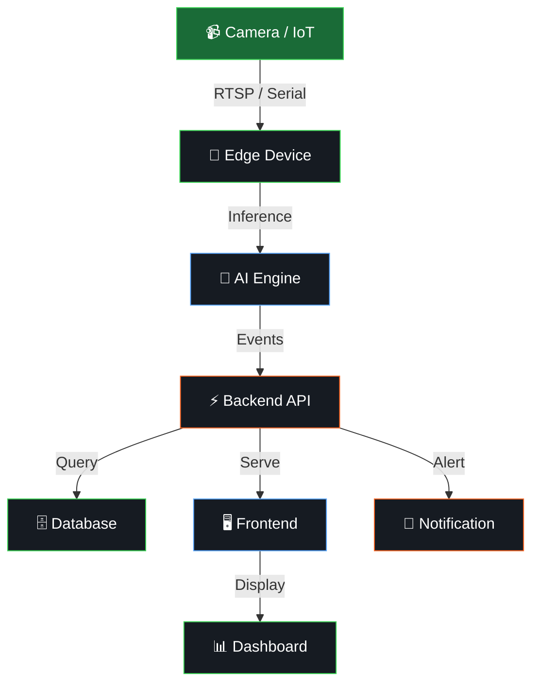

<div align="center">
  
</div>

<!-- ANIMATED TYPING -->
<div align="center">
  <a href="https://github.com/ferryamludn2">
    
  </a>
</div>

<br>

<!-- SOCIAL BADGES -->
<div align="center">
  <a href="https://www.linkedin.com/in/ferry-amaludin-31a964259/"></a>&nbsp;
  <a href="mailto:ferryamludn.work@gmail.com"></a>&nbsp;
  <a href="https://www.graybirdin.com"></a>&nbsp;
  <a href="https://github.com/ferryamludn2"></a>&nbsp;
  
</div>

<br>

<!-- ═══════════════════════════════════════════════════════════════ -->
<!-- ██████╗  ██████╗ ███╗   ██╗████████╗██████╗ ██╗██████╗        -->
<!-- ██╔════╝██╔═══██╗████╗  ██║╚══██╔══╝██╔══██╗██║██╔══██╗       -->
<!-- ██║     ██║   ██║██╔██╗ ██║   ██║   ██████╔╝██║██████╔╝       -->
<!-- ██║     ██║   ██║██║╚██╗██║   ██║   ██╔══██╗██║██╔══██╗       -->
<!-- ╚██████╗╚██████╔╝██║ ╚████║   ██║   ██║  ██║██║██████╔╝       -->
<!--  ╚═════╝ ╚═════╝ ╚═╝  ╚═══╝   ╚═╝   ╚═╝  ╚═╝╚═╝╚═════╝       -->
<!-- ═══════════════════════════════════════════════════════════════ -->

##  Contribution Snake

<div align="center">
  <picture>
    <source media="(prefers-color-scheme: dark)" srcset="https://raw.githubusercontent.com/ferryamludn2/ferryamludn2/output/github-snake-dark.svg">
    <source media="(prefers-color-scheme: light)" srcset="https://raw.githubusercontent.com/ferryamludn2/ferryamludn2/output/github-snake.svg">
    
  </picture>
</div>

> ⚠️ *Snake animation akan muncul setelah GitHub Action "Generate Snake" dijalankan pertama kali. Buka tab **Actions** → Run workflow secara manual.*

<br>

<!-- ═════════════════ GITHUB STATS ═════════════════ -->

##  GitHub Statistics

<div align="center">
  
  
</div>

<br>

<div align="center">
  
</div>

<br>

<div align="center">
  
</div>

<br>

<!-- ═════════════════ ABOUT ME ═════════════════ -->

##  About Me


```yaml
name: Ferry Amaludin
education: S1 Teknik Elektro — Universitas Jenderal Soedirman
location: Indonesia 🇮🇩

roles:
  primary: "Backend Developer / Software Engineer"
  secondary: "Full-Stack Developer"
  specialty: "AI / Computer Vision Engineer"
  niche: "IoT / Edge AI"

mindset: |
  Bukan sekadar belajar teknologi,
  tapi membangun solusi end-to-end.
  Dari masalah → bangun → deploy → tes → iterate 🔧

currently:
  learning: "Edge AI Deployment & System Design"
  building: "AI-powered monitoring systems"
  exploring: "Computer Vision × IoT integration"
```

<br clear="both">

<!-- ═════════════════ TECH STACK ═════════════════ -->

##  Tech Stack

<div align="center">

<!-- Languages -->
<table>
<tr><td align="center" width="900">
<h4>💬 Languages</h4>

</td></tr>
</table>

<!-- Frontend & Mobile -->
<table>
<tr><td align="center" width="900">
<h4>🎨 Frontend & Mobile</h4>

</td></tr>
</table>

<!-- Backend & API -->
<table>
<tr><td align="center" width="900">
<h4>⚙️ Backend & API</h4>

</td></tr>
</table>

<!-- Database -->
<table>
<tr><td align="center" width="900">
<h4>🗄️ Database & ORM</h4>

</td></tr>
</table>

<!-- AI / ML -->
<table>
<tr><td align="center" width="900">
<h4>🤖 AI / ML / Computer Vision</h4>

</td></tr>
</table>

<!-- Infrastructure -->
<table>
<tr><td align="center" width="900">
<h4>🐳 Infrastructure & DevOps</h4>

</td></tr>
</table>

<!-- IoT -->
<table>
<tr><td align="center" width="900">
<h4>📡 IoT & Hardware</h4>

<br><br>


</td></tr>
</table>

</div>

<br>

<!-- ═════════════════ SYSTEM ARCHITECTURE ═════════════════ -->

##  System Architecture

<div align="center">



</div>

<div align="center">
  <sub><b>Camera → Edge Device → AI Inference → API → Database → Dashboard → Monitoring</b></sub>
</div>

<br>

<!-- ═════════════════ FEATURED PROJECTS ═════════════════ -->

##  Featured Projects

<div align="center">

<table>
<tr>
<td width="50%" valign="top">

### <div align="center">🤑 CashFlox</div>
<div align="center">

**Financial AI App**

Control money with custom categories, budgeting, and smart financial tracking.


<br>

<a href="https://play.google.com/store/apps/details?id=com.ferryamludn.walfare"></a>

</div>

</td>
<td width="50%" valign="top">

### <div align="center">🌐 Graybird</div>
<div align="center">

**Social Media Platform**

Full-featured social platform with real-time interactions and seamless connectivity.


<br>

<a href="https://play.google.com/store/apps/details?id=com.ferryamludn.graybird"></a>

</div>

</td>
</tr>
<tr>
<td width="50%" valign="top">

### <div align="center">📦 Daganganku</div>
<div align="center">

**POS & Inventory System**

High-performance point-of-sale with receipt generation and analytics dashboard.


<br>

<a href="https://graybirdin.com"></a>

</div>

</td>
<td width="50%" valign="top">

### <div align="center">🧠 Graybird Farm AI</div>
<div align="center">

**AI Poultry Monitoring**

End-to-end: IP Camera → YOLO → OpenCV → FastAPI → Next.js Dashboard.


<br>

<a href="https://github.com/ferryamludn2"></a>

</div>

</td>
</tr>
<tr>
<td width="50%" valign="top">

### <div align="center">🔗 NestJS Backend</div>
<div align="center">

**Scalable API Boilerplate**

Production-ready backend with auth, clean architecture, and PostgreSQL.


<br>

<a href="https://github.com/ferryamludn2/backend-stokbarang.git"></a>

</div>

</td>
<td width="50%" valign="top">

### <div align="center">🔬 TensorFlow Research</div>
<div align="center">

**AI Skin Disease Detection**

Published research using MobileNetV2 architecture for dermatology.


<br>

<a href="https://doi.org/10.61124/sinta.v2i2.43"></a>

</div>

</td>
</tr>
</table>

</div>

<br>

<!-- ═════════════════ GRAYBIRD PLATFORM ═════════════════ -->

##  Graybird Platform

<div align="center">
  <a href="https://www.graybirdin.com/tools"></a>&nbsp;&nbsp;
  <a href="https://www.graybirdin.com/games"></a>&nbsp;&nbsp;
  <a href="https://www.graybirdin.com"></a>
</div>

<br>

<!-- ═════════════════ CONNECT ═════════════════ -->

##  Let's Connect

<div align="center">

```
╔══════════════════════════════════════════════════════════════╗
║                                                              ║
║   💼  Open for collaboration, freelance & open-source        ║
║   📧  ferryamludn.work@gmail.com                            ║
║   🔗  linkedin.com/in/ferry-amaludin-31a964259              ║
║   🌐  graybirdin.com                                        ║
║   ⏱️  Response time: < 24h                                  ║
║                                                              ║
╚══════════════════════════════════════════════════════════════╝
```

<br>

<a href="https://www.linkedin.com/in/ferry-amaludin-31a964259/"></a>&nbsp;
<a href="mailto:ferryamludn.work@gmail.com"></a>&nbsp;
<a href="https://github.com/ferryamludn2"></a>

</div>

<br>

<!-- ═════════════════ FOOTER ═════════════════ -->

<div align="center">
  
</div>